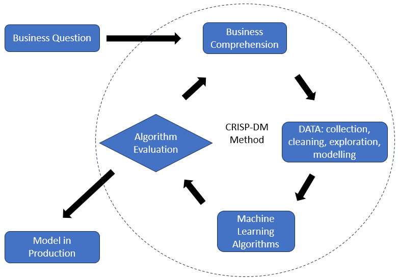
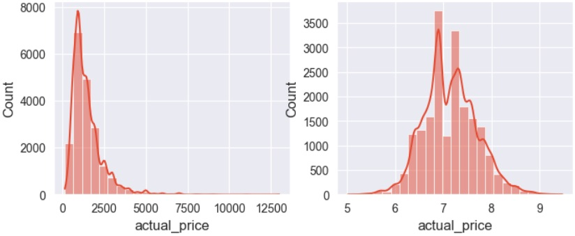
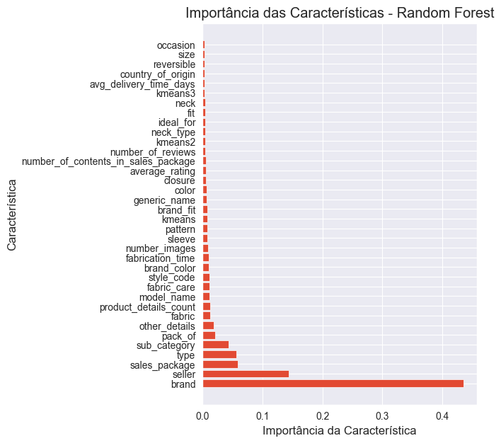
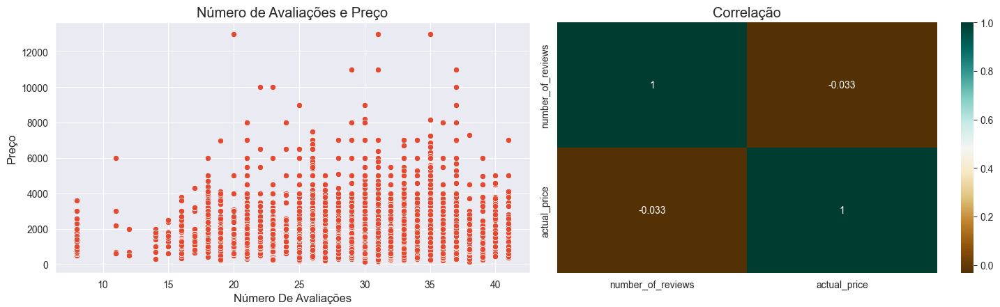
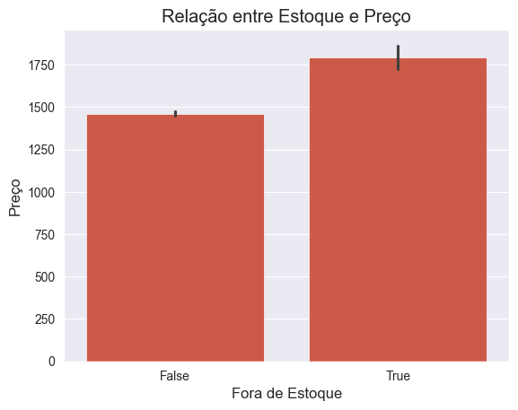

<h1 align="center">
PRODUCT PRICE PREDICTION 
IN FASHION RETAIL
</h1>

<h6>- <a href="README.md">VERSÃO EM PORTUGUÊS</a></h6>

# 1. THE BUSINESS PROBLEM

In this fictional environment, the company Dados & Decotes operates in e-commerce in the field of men's and women's fashion focusing on clothing, footwear, and accessories. The current challenge for the retailer is to **optimize product prices** in order to maximize profit from sales.

The current product pricing system has two stages. **First**, a fixed profit margin is added to the product's cost price. In the **second stage**, after 3 months of evaluating sales behavior, prices are adjusted according to the demand quantities of each product.

From the studies to be conducted by the Data Team, it is desired to implement a **third stage** of pricing, in which the prices of new products recently launched on the market will be optimized based on their characteristics, such as brand, category, fabric, and others.

The flowchart illustrates the current process and the introduction of the new pricing stage.

<table align="center">
<tr><td>

</td></tr>
</table>

# 2. SOLUTION PLANNING

The challenge for the Data Science Team is to determine the prices of new products, based on the pricing history and characteristics of the most successful products in the first two pricing stages.

## 2.1. Final Product

There are two expected outcomes:
1. The development of a data analysis and machine learning procedure designed to meet the company's demands for predicting merchandise prices, and
2. The elaboration of [business-related insights](#72-main-insights) from the data analysis.

## 2.2. Solution Strategy

The work was carried out following the CRISP-DM1 method, or "Cross Industry Standard Process for Data Mining", a cyclic approach aimed at improving quality and speeding up the delivery of results in Data Science projects. The method can be summarized in the following set of steps:
1. Business understanding
2. Data collection, processing, and modeling
3. Machine Learning algorithms
4. Results evaluation
5. Production implementation.

# 3. DATA COLLECTION

As presented in Section 1 - business problem, the information to be used in the price prediction project was provided by the client company. The dataset provided has the following structure:

<table align="center">
  <tr>
    <th align="center">ATTRIBUTE</th>
    <th>DESCRIPTION AND NOTES</th>
  </tr>
  <tr>
    <td align="center">_id</td>
    <td>Unique identifier for the row.</td>
  </tr>
  <tr>
    <td align="center">pid</td>
    <td>Product identifier.</td>
  </tr>
  <tr>
    <td align="center">average_rating</td>
    <td>Average rating of the product.</td>
  </tr>
  <tr>
    <td align="center">number_of_reviews</td>
    <td>Number of reviews for the product.</td>
  </tr>
  <tr>
    <td align="center">brand</td>
    <td>Brand of the product.</td>
  </tr>
  <tr>
    <td align="center">category</td>
    <td>Category of the product.</td>
  </tr>
  <tr>
    <td align="center">crawled_at</td>
    <td>Date and time when the data was collected from the website.</td>
  </tr>
  <tr>
    <td align="center">description</td>
    <td>Description of the product.</td>
  </tr>
  <tr>
    <td align="center">images</td>
    <td>URL of the product images on the showcase.</td>
  </tr>
  <tr>
    <td align="center">out_of_stock</td>
    <td>Whether the product is in stock or not.</td>
  </tr>
  <tr>
    <td align="center">avg_time_delivery_days</td>
    <td>Average delivery time in days.</td>
  </tr>
  <tr>
    <td align="center">product_details</td>
    <td>Dictionary containing product details (see section 4.2)</td>
  </tr>
  <tr>
    <td align="center">seller</td>
    <td>Seller of the product.</td>
  </tr>
  <tr>
    <td align="center">sub_category</td>
    <td>Subcategory of the product.</td>
  </tr>
  <tr>
    <td align="center">fabrication_time</td>
    <td>Fabrication time of the product in days.</td>
  </tr>
  <tr>
    <td align="center">title</td>
    <td>Title of the product listing.</td>
  </tr>
  <tr>
    <td align="center">actual_price</td>
    <td>Target price (response variable).</td>
  </tr>
</table>

(Source: [Kaggle](https://www.kaggle.com/competitions/product-price-predicition-20/overview))

# 4. FEATURE ENGINEERING

This stage aims to prepare the variables (features), as well as synthesize new variables, so that they are available for exploratory analysis and all other stages of the predictive model development.

## 4.1. Target Variable Transformation

The target variable is the price of the merchandise (or "actual_price"). The histogram indicated a right skew. Therefore, to make the distribution closer to the normal curve, a logarithmic transformation of the price was performed. The result is shown in the figure.

<table align="center">
<tr><td>

</td></tr>
</table>

## 4.2. "product_details" Column

This column is of great importance, as it contains various **sub-columns** that inform the characteristics of each product. It is observed that different products may have different types of characteristics. Let's look at some examples:

**Example-1**: product no. 22898
- Title: **Slim Men Light Blue Jeans**
- Product details: {'Style Code': 'D63-D'}, {'Ideal For': 'Men'}, {'Suitable For': 'Western Wear'}, {'Pack Of': '1'}, {'Pocket Type': 'Curved Pocket'}, {'Pattern': 'Chevron'}, {'Reversible': 'No'}, {'Fabric': 'Cotton Polyester Lycra Blend'}, {'Faded': 'Light Fade'}, {'Rise': 'Mid Rise'}, {'Distressed': 'Mild Distress'}, {'Stretchable': 'Yes'}, {'Color': 'Light Blue'}, {'Generic Name': 'Jeans'}, {'Country of Origin': 'India'}

**Example-2**: product no. 9459
- Title: **ADJUSTER Cap**
- Product details: {'Fabric': '55% cotton 45% Polyester'}, {'Color': 'Black'}, {'Style Code': 'DS09BC073K'}, {'Occasion': 'Casual'}, {'Sales Package': '1 Cap'}

**Example-3**: product no. 18458
- Title: **Slides**
- Product details: {'Color': 'Black'}, {'Care instructions': 'Dust any dry dirt from the surface using a clean wet cloth or use soap in case of excess dirt, do not use any polish. Store your pair of slippers in a clean place.'}, {'Sole Material': 'PVC'}

In these examples, the feature "Color" appears in all three products. On the other hand, there are various characteristics that appear in only one of the products, such as "Country of Origin", "Suitable For", "Sales Package", "Care instructions", among others. That is, these examples show that the sub-columns of "product_details" contain sparse information about the products. Therefore, to improve the quality of the analysis, it was necessary to convert these sub-columns into new data columns for prediction, and then submit them to various pre-processing.

## 4.3. Other Columns and Sub-Columns

In addition to the pre-processing of the "product_details" column mentioned above, the following enhancements were also implemented within the restricted 48-hour period of the Hackday event:
- The sub-columns "fabric" (type of fabric) and "brand fit" (product shape) were used to generate the binary columns "has_cotton," "has_polyester," "has_lycra," "is_regular," "is_slim," and "is_fit."
- The "images" column was used to count the number of photographs available for each product.

Following that Hackday, we implemented other enhancements to the "feature engineering" stage, resulting in improved model accuracy. The new techniques used were as follows:
- Word Count: The "title" and "description" columns contain extensive free-form text describing the merchandise. Thus, a count of all words was conducted, which, once ranked, were converted into 220 binary columns indicating which words define each product. This technique was also used with other sub-columns such as "other details" and "generic name."
- The sub-columns "pack of" and "number of contents in sales package" had their contents combined into a single column, as they contain similar information.
- The "size" sub-column was converted to numeric information, respecting a size scale, such as XXL, XL, L, M, S, XS, XXS, etc.

## 4.4. Description of Goods and Word Count

The database contains many text variables, especially the product description field - "description" - characterized as free text. To leverage this information, code was developed for extracting and counting words (see section 2.7 of the code). The algorithm follows these steps:

1. Selection of a subset of columns that contain relevant text information for a detailed analysis. This includes the "description" column as well as "title", "OTHER DETAILS", "category", among others.

2. Creation of a set of keywords through iteration and search within the selected columns. During processing, **6,820** unique words were found.

3. Word counting, in order to define the relative importance of each word based on its frequency in the database.

4. Filtering of words by occurrence, to only include in the processing the most frequently occurring words, considered the most important ones. In this case, **275 words** with the highest frequency were kept.

5. Creation of 275 columns in the dataframe, to represent the occurrence of each word in each record of the database.

With the inclusion of these 275 new features, a significant improvement was achieved in the performance of the final regression model.

<table align="center">
<tr><td>

</td></tr>
</table>

## 4.5. Pre-Processing: category encoding

The database of this project is characterized by having a significant amount of categorical variables in text form. As most machine learning algorithms require numerical data, their numerical encoding was provided through "one-hot encoding" and "target encoding".

The "one-hot encoding" type allows for the creation of a binary variable for each existing category in the original categorical variable. In this project, it was decided to use this encoding for the "category" column, generating three new binary columns.

The "target encoding" type, or encoding focused on the target, seeks to measure the effect that a certain category would have on the target variable, or the probability of the target representing an encoding of that category, as explained by Trevisan2 and Lewinson5, pg. 555-556.

In this project, most categorical variables were encoded using the "target encoding" method.

## 4.6. Pre-Processing: K-MEANS for clustering similar products

The K-Means method is an unsupervised clustering algorithm. Some authors suggest using this clustering algorithm as a nonlinear strategy for dimensionality reduction, or to create extra columns to train another model (see Géron4, pg. 265).

Applying this idea to the current project, during pre-processing, we used the K-Means method to form groups of products with similar characteristics and then provided this information as a new column for the price prediction model. Various combinations of product characteristics were experimented with to allow for the most efficient clusterizations. In the end, three distinct groupings were utilized, resulting in an increase in model accuracy.

## 4.7. Pre-Processing: variable selection

After all the pre-processing, the Random Forest model was used to rank the variables according to their ability to contribute to the outcome of the prediction model. The result is shown in the figure below.

<table align="center">
<tr><td>

</td></tr>
</table>

# 5. EXPLORATORY DATA ANALYSIS

The exploratory analysis was divided into four stages aimed at deepening the understanding of the data and, consequently, of the business.

The stages were:
- Univariate analysis - to understand the distribution of each variable;
- Bivariate analysis - how each variable impacts the price of the merchandise;
- Multivariate analysis - searching for correlations between variables;
- Formulation of business hypotheses.

As a result of this analysis, some characteristics of the business and their effects on the prices of the merchandise were observed. The conclusions are described in [section 7.2](#72-main-insights), below.

# 6. MACHINE LEARNING ALGORITHMS

The work was divided into two stages:
- Stage-1: identify the algorithm that resulted in the model with the lowest error. For this, six different *machine learning* algorithms were tested, configured with their hyperparameters set to default values.
- Stage-2: use the algorithm selected in the previous stage and optimize its hyperparameters to arrive at the definitive model.

The table below presents the results of Stage-1 with the performance of each of the tested models.

<table align="center">
  <tr>
    <th align="center">Model</th>
    <th align="right">MAE</th>
    <th align="right">MAPE</th>
    <th align="right">RMSE</th>
    <th align="right">SMAPE</th>
  </tr>
  <tr>
    <td align="center">RandomForest</td>
    <td align="right">170.251782</td>
    <td align="right">0.108400</td>
    <td align="right">391.477521</td>
    <td align="right">10.295032</td>
  </tr>
  <tr>
    <td align="center">VotingRegressor</td>
    <td align="right">192.442082</td>
    <td align="right">0.125997</td>
    <td align="right">380.228307</td>
    <td align="right">12.166790</td>
  </tr>
  <tr>
    <td align="center">XGBoost</td>
    <td align="right">203.984165</td>
    <td align="right">0.133901</td>
    <td align="right">394.197619</td>
    <td align="right">12.941397</td>
  </tr>
  <tr>
    <td align="center">CatBoost</td>
    <td align="right">206.766272</td>
    <td align="right">0.136696</td>
    <td align="right">378.871272</td>
    <td align="right">13.279772</td>
  </tr>
  <tr>
    <td align="center">LightGBM</td>
    <td align="right">220.647464</td>
    <td align="right">0.145251</td>
    <td align="right">411.002568</td>
    <td align="right">14.018622</td>
  </tr>
  <tr>
    <td align="center">LinearRegression</td>
    <td align="right">348.806300</td>
    <td align="right">0.231574</td>
    <td align="right">1004.327188</td>
    <td align="right">22.284824</td>
  </tr>
</table>

As can be observed, the Random Forest algorithm provided the best result for the metric under analysis, which is why it was the algorithm used in Stage-2.

- NOTE: SMAPE = Symmetric Mean Absolute Percentage Error

# 7. RESULTS

## 7.1. Prediction Model Performance

The performance of the model during the Hackday competition phase is listed on the [Kaggle leaderboard](https://www.kaggle.com/competitions/product-price-predicition-20/leaderboard), having achieved a SMAPE percentage error of **9.11%**, as shown in the figure below.

Regarding this result, it is worth noting that, during the competition, the performance of the model was subject to two important constraints, namely, the scarce time of less than 48 hours for the development of the work and the limited number of submissions for evaluation. Together, these two constraints limited the depth of research. Nevertheless, our team of data scientists achieved the honorable **1st Place in the Contest**, both in terms of error reduction and peer voting criteria.

In subsequent research, after the competition had ended, we applied additional rounds of the CRISP-DM method, with a revision of the feature engineering stage. As a result, we managed to improve the performance of the model, which achieved a SMAPE percentage error of **8.19%**, as shown in the following figure.

<table align="center">
<tr><td>

</td></tr>
</table>

## 7.2. Main Insights

### 7.2.1. Relationship between "number of images" and "product price"

The analysis of the data indicated that products with more images have higher prices. From this insight, it is possible to assert that a campaign to enhance the visual information of products can have a positive impact on demand, and consequently on the price.

### 7.2.2. Relationship between "number of reviews" and "product price"

The analysis of the data did not indicate any notable correlation between these characteristics.

### 7.2.3. Relationship between "stock condition" and "product price"

The analysis showed a tendency for products that are out of stock to have higher prices. This condition may represent a company strategy to manage inventory by increasing the prices of products that are about to be out of stock.

<table align="center">
<tr><td>

</td></tr>
</table>

# 8. CONCLUSION

In this study, a business problem involving a retail company was analyzed, with the goal of developing a machine learning model for product price prediction. Upon completion, two outcomes were achieved: (i) a machine learning model with an error rate of less than 8.2% in a production environment, and (ii) several important insights regarding business behavior.

# 9. NEXT STEPS

- Implement stock optimization based on the price prediction model.
- Enhance the feature engineering stage with improved feature selection.
- Implement dimensionality reduction techniques, such as: principal component analysis (PCA), locally linear embedding (LLE), or autoencoders.

# 10. DEVELOPMENT TEAM

The work was developed during the 6th Hackday of the DS Community, a Data Science competition that took place on October 21-22, 20233.

The participants from the **MAY THE DATA BE WITH YOU** team were:
- Edilson Santos
- Aroldo Brancalhão
- Leonardo Rose
- Manoel Mendonça
- M. Alessandro Fonseca

# 11. REFERENCES

1. Web: about the [CRISP-DM Method](https://www.escoladnc.com.br/blog/data-science/metodologia-crisp-dm/)
2. Article: [Target-encoding Categorical Variables](https://towardsdatascience.com/dealing-with-categorical-variables-by-using-target-encoder-a0f1733a4c69), Vinícius Trevisan, March 17, 2022.
3. Site on Kaggle: [6th Hackday CDS - Product Price Prediction](https://www.kaggle.com/competitions/product-price-predicition-20/overview)
4. Book: "Hands-On Machine Learning with Scikit-Learn, Keras & TensorFlow", Aurélien Géron, 3rd edition, 2023
5. Book: "Python for Finance Cookbook", Eryk Lewinson, 2nd edition, 2022
