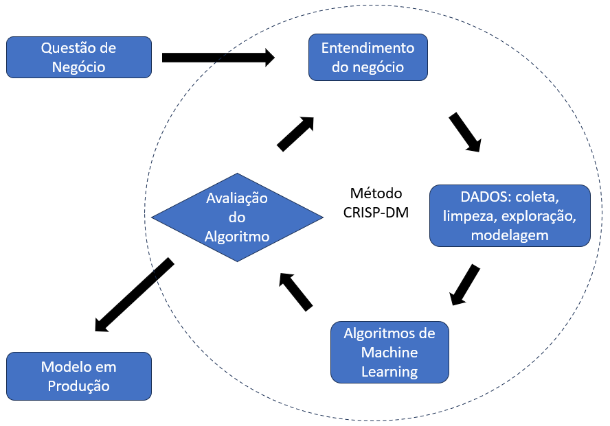

<h1 align="center">
PREVISÃO DE PREÇOS DE PRODUTOS 
NO VAREJO DA MODA
</h1>

<h6>- <a href="README-en.md">ENGLISH VERSION</a></h6>

# 1. O PROBLEMA DE NEGÓCIO

Nesse ambiente fictício, a empresa Dados & Decotes atua no e-commerce no ramo de moda masculina e feminina com foco em roupas, calçados e acessórios. O desafio atual da varejista é **otimizar os preços dos seus produtos** de modo a maximizar o lucro nas vendas.

O sistema original de precificação de produtos tem duas etapas. <b>Primeiro</b> é colocada margem fixa de lucro sobre o preço de custo do produto. Na <b>segunda etapa</b>, após 3 meses de avaliação do comportamento das vendas, os preços são ajustados de acordo com as quantidades demandadas de cada produto.

A partir dos estudos a serem realizados pela Equipe de Dados, deseja-se implantar uma **terceira etapa** de precificação, na qual os preços dos produtos novos e recém lançados no mercado serão otimizado com base nas suas características, tais como marca, categoria, tecido e outras.

O fluxograma ilustra o processo atual e a introdução da nova etapa de precificação.

# 2. PLANEJAMENTO DA SOLUÇÃO

O desafio da Eequipe de Cientistas de Dados é encontrar quais os preços dos novos produtos, com base no histórico de preços e nas características dos produtos de maior sucesso em vendas nas duas primeiras etapas de precificação.

## 2.1. Produto Final

São dois os resultados esperados:
1. O desenvolvimento de um procedimento de análise de dados e <i>machine learning</i> projetado para atender as demandas da empresa quanto a previsão de preços de mercadorias, e
2. Elaboração de <i>insights</i> relacionados ao negócio, a partir da análise dos dados.

## 2.2. Estratégia de Solução

O trabalho foi realizado seguindo o método CRISP-DM1, ou "<i>Cross Industry Standard Process for Data Mining</i>", uma abordagem cíclica objetivando aprimorar a qualidade e agilizar a entrega de resultado em projetos de Ciência de Dados. O método pode ser resumido no seguinte conjunto de etapas:
1. Entendimento do negócio
2. Coleta, tratamento e modelagem de dados
3. Algoritmos de <i>Machine Learning</i>
4. Avaliação dos resultados
5. Entrada em produção.

# 3. COLETA DE DADOS

Conforme apresentado na seção 1 - descrição do problema, as informações a serem utilizadas no projeto de previsão de preços foram fornecidas pela empresa cliente. O dataset fornecido tem a seguinte estrutura:

| COLUNA | Descrição |
|--------|-----------|
| _id | identificador único da linha |
| pid | identificador do produto |
| average_rating | avaliação média do produto |
| number_of_reviews | número de avaliações do produto |
| brand | marca do produto |
| category | categoria do produto |
| crawled_at | data e hora em que o dado foi coletado no site |
| description | descrição do produto |
| images | url das imagens do produto na vitrine |
| out_of_stock | se o produto encontra-se ou não no estoque |
| avg_time_delivery_days | tempo médio de entrega em dias |
| product_details | dicionário contendo detalhes do produto |
| seller | vendedor do produto |
| sub_category | subcategoria do produto |
| fabrication_time | tempo de fabricação do produto em dias |
| title | título do anúncio do produto |
| actual_price | preço alvo (variável de resposta) |

(Fonte: Kaggle)

# 4. FEATURE ENGINEERING

Esta etapa tem por objetivo preparar as variáveis (features), bem assim sintetizar novas variáveis, para que estejam disponíveis para a análise exploratória e para todas as demais etapas do desenvolvimento do modelo de previsão.

## 4.1. Transformação da variável alvo

A variável alvo é o preço da mercadoria (ou "actual_price"). O histograma indicou assimetria para a direita. Assim, para tornar a distribuição mais próxima da curva normal, fez-se a transformação logarítmica do preço. O resultado é apresentado na figura.

## 4.2. Coluna "product_details"

Esta coluna é de grande importância, pois contém diversas **sub-colunas** que informam as características de cada produto. Observa-se que diferentes produtos podem ter diferentes tipos de características. Vejamos alguns exemplos:

<b>Exemplo-1</b>: produto nº 22898
- Título: <b>Slim Men Light Blue Jeans</b>
- Detalhes do produto: {'Style Code': 'D63-D'}, {'Ideal For': 'Men'}, {'Suitable For': 'Western Wear'}, {'Pack Of': '1'}, {'Pocket Type': 'Curved Pocket'}, {'Pattern': 'Chevron'}, {'Reversible': 'No'}, {'Fabric': 'Cotton Polyester Lycra Blend'}, {'Faded': 'Light Fade'}, {'Rise': 'Mid Rise'}, {'Distressed': 'Mild Distress'}, {'Stretchable': 'Yes'}, {'Color': 'Light Blue'}, {'Generic Name': 'Jeans'}, {'Country of Origin': 'India'}

<b>Exemplo-2</b>: produto nº 9459
- Título: <b>ADJUSTER Cap</b>
- Detalhes do produto: {'Fabric': '55% cotton 45 % Polyster'}, {'Color': 'Black'}, {'Style Code': 'DS09BC073K'}, {'Occasion': 'Casual'}, {'Sales Package': '1 Cap'}

<b>Exemplo-3</b>: produto nº 18458
- Título: <b>Slides</b>
- Detalhes do produto: {'Color': 'Black'}, {'Care instructions': 'Dust any dry dirt from the surface using a clean wet cloth or use soap in case of excess dirt, do not use any polish. Store your pair of slippers in a clean place.'}, {'Sole Material': 'PVC'}

Nesses exemplos a característica "Color" aparece nos três produtos. Por outro lado, há várias características que aparecem em apenas um dos produtos, como "Country of Origin", "Suitable For", "Sales Package", "Care instructions", entre outras. Ou seja, esses exemplos mostram que as sub-colunas de "product_detail" contêm informações esparsas acerca dos produtos. Assim, para aprimorar a qualidade da análise, foi necessário converter essas sub-colunas em novas colunas de dados para previsão, e então submetê-las a diversos pré-processamentos.

## 4.3. Outras Colunas e Sub-Colunas

Além do pré-processamento da coluna "product_details" citado acima, os seguintes aprimoramentos foram também implementados dentro do restrito período de 48 horas do evento Hackday:
- As sub-colunas "fabric" (tipo de tecido) e "brand fit" (~forma do produto) foram utilizadas para gerar as colunas binárias "has_cotton", "has_polyester", "has_lycra", "is_regular", "is_slim" e "is_fit".
- A coluna "images" foi utilizada para contar o número de fotografias disponíveis para cada produto.

Posteriormente àquele Hackday, implementamos novos aprimoramentos à etapa de "feature engineering", resultando em melhoria da acurácia do modelo. As novas técnicas utilizadas foram as seguintes:
- Contagem de Palavras: as colunas "title" e "description" contêm extensos textos livres descritivos das mercadorias. Assim, foi realizada a contagem de todas as palavras que, ranqueadas, foram convertidas em 220 colunas binárias indicativas de quais palavras definem cada produto. Essa técnica foi utilizada também com outras sub-colunas, como "other details" e "generic name".
- As sub-colunas "pack of" e "number of contents in sales package" tiveram seu conteúdo reunido em uma única coluna, dado conterem informações semelhantes.
- A sub-coluna "size" foi convertida para informação numérica, respeitando uma grade de tamanhos, do tipo XXL, XL, L, M, S, XS, XXS, etc.

## 4.4. Pré-Processamento: codificação de categorias

A base de dados deste projeto se caracteriza por ter uma quantidade expressiva de variáveis categóricas em forma de texto. Como a maioria dos algoritmos de <i>machine learning</i> requerem dados numéricos, foi providenciada sua codificação numérica por meio de "one-hot encoding" e "target encoding".

A codificação do tipo "one-hot encoding" permite criar uma variável binária para cada categoria existente na variável categórica original. No presente projeto, decidiu-se por utilizar essa codificação para a coluna "category", gerando três novas colunas binárias.

A codificação do tipo "target encoding", ou codificação focada no alvo, busca medir o efeito que determinada categoria causaria na variável alvo, ou a probabilidade de o alvo representar uma codificação daquela categoria, conforme explicam Trevisan2 e Lewinson5, pg. 555-556.

No presente projeto, a maioria das variáveis categóricas foram codificadas utilizando o método "target encoding".

## 4.5. Pré-Processamento: K-MEANS para agrupamento de produtos semelhantes

O método K-Means é um algoritmo não-supervisionado de agrupamento (ou clusterização). Há autores que sugerem a utilização desse algoritmo de agrupamento como estratégia não-linear para redução de dimensionalidade, ou ainda para a criação de colunas extras para treinar um outro modelo (ver Géron4, pg. 265).

Trazendo a ideia para o presente projeto, durante o pré-processamento, utilizamos o método K-Means para formar grupos de produtos com características semelhantes para depois oferecer esta informação como uma nova coluna para o modelo de previsão de preços. Várias combinações de características dos produtos foram experimentadas de modo a permitir as clusterizações mais eficientes. Ao final, foram aproveitados três agrupamentos distintos, resultando em aumento da precisão do modelo.

## 4.6. Pré-Processamento: seleção de variáveis

Após todo o pré-processamento, fez-se uso do modelo de <i>Random Forest</i> para ranquear as variáveis de acordo com sua capacidade de contribuir no resultado do modelo de previsão. O resultado é apresentado na figura abaixo.

# 5. ANÁLISE EXPLORATÓRIA DE DADOS

A análise exploratória foi dividida em quatro etapas visando a aprofundar o conhecimento sobre os dados e, consequentemente, sobre o negócio.

As etapas foram:
- Análise univariada - para conhecer a distribuição de cada variável;
- Análise bivariada - como cada variável impacta no preço da mercadoria;
- Análise multivariada - busca por correlações entre as variáveis;
- Formulação de hipóteses de negócios.

Como resultado dessa análise, foram observadas algumas características do negócio e seus efeitos no preço das mercadorias. As conclusões estão descritas no tópico 7.2, abaixo.

# 6. ALGORITMOS DE <i>MACHINE LEARNING</i>

O trabalho foi dividido em duas etapas. 
- Etapa-1: identificar o algoritmo que resultasse no modelo de menor erro. Para isso, foram testados seis diferentes algoritmos de <i>machine learning</i>, configurados com os hiperparâmetros em seus valores-padrão.
- Etapa-2: usar o algoritmo eleito na etapa anterior e otimizar seus hiperparâmetros para se chegar ao modelo definitivo.

Na tabela abaixo apresenta-se o resultado da etapa-1 com o desempenho de cada um dos modelos testados.

Como se pode observar, o algoritmo Random Forest foi o que trouxe o melhor resultado para a métrica sob análise, motivo pelo qual foi o algoritmo utilizado na etapa-2.

- OBS: SMAPE = *Symmetric Mean Absolute Percentage Error*

# 7. RESULTADOS

## 7.1. Desempenho do Modelo de Previsão

O desempenho do modelo durante a etapa de competição Hackday consta no [quadro do Kaggle](https://www.kaggle.com/competitions/product-price-predicition-20/leaderboard), tendo alcançado erro percentual SMAPE de <b>9,11%</b>, conforme figura abaixo.

Em relação a esse resultado, vale ressaltar que, durante a competição, o desempenho do modelo esteve sujeito a duas importantes restrições, a saber, o tempo escasso de menos de 48 horas para desenvolvimento do trabalho e o número limitado de submissões para avaliação. Juntas, essas duas restrições limitaram o aprofundamento das pesquisas. Ainda assim, nossa equipe de cientistas de dados conseguiu o honroso <b>1º Lugar no Certame</b>, tanto no critério de redução do erro, quanto no critério de votação pelos pares.

Em pesquisas posteriores, após encerrada a competição, aplicamos novas rodadas do método CRISP-DM, com revisão da etapa de <i>feature engineering</i>. Com isso, conseguimos melhorar o desempenho do modelo, que alcançou erro percentual SMAPE de <b>8,19%</b>, conforme figura.

## 7.2. Os Principais <i>Insights</i>

### 7.2.1. Relação entre "número de imagens" e "preço do produto"

A análise dos dados indicou que os produtos com mais imagens possuem preços maiores. A partir deste <i>insight</i>, é possível afirmar que uma campanha de aprimoramento das informações visuais dos produtos pode ter impacto positivo na demanda, e consequentemente no preço.

### 7.2.2. Relação entre "número de avaliações" e "preço do produto"

A análise dos dados não indicou haver correlação notável entre essas características.

### 7.2.3. Relação entre "condição do estoque" e "preço do produto"

A análise mostrou uma tendência a terem preços maiores os produtos em falta no estoque. Tal condição pode representar uma estratégia da empresa para administrar o estoque, majorando os preços de produtos que estejam em vias de terem seu estoque zerado.

# 8. CONCLUSÃO

No presente trabalho foi analisado um problema de negócio envolvendo empresa do ramo varejista, tendo por objetivo o desenvolvimento de modelo de <i>machine learning</i> para previsão de preços de produtos. Feito o trabalho, dois resultados foram alcançados: (i) um modelo de <i>machine learning</i> com erro menor que 8,2% em ambiente de produção, e (ii) alguns importantes <i>insights</i> quanto ao comportamento do negócio.

# 9. PRÓXIMOS PASSOS

- Implantar otimização do estoque com base no modelo de previsão de preços.
- Aprimorar a etapa de <i>feature engineering</i> com o aprimoramento da seleção de features.
- Implementar técnicas de redução de dimensionalidade, tais como: <i>principal component analysis</i> (PCA), <i>locally linear embedding</i> (LLE) ou <i>autoencoders</i>.

# 10. EQUIPE DE DESENVOLVEDORES

O trabalho foi desenvolvido durante o 6º Hackday da Comunidade DS, competição de Ciência de Dados ocorrida nos dias 21.22/outubro/20233.

Os participantes da equipe <b>MAY THE DATA BE WITH YOU</b> foram:
- Edilson Santos
- Aroldo Brancalhão
- Leonardo Rose
- Manoel Mendonça
- M.Alessandro Fonseca

# 11. REFERÊNCIAS
1. Web: sobre o [Método CRISP-DM](https://www.escoladnc.com.br/blog/data-science/metodologia-crisp-dm/)
2. Artigo: [Target-encoding Categorical Variables](https://towardsdatascience.com/dealing-with-categorical-variables-by-using-target-encoder-a0f1733a4c69), Vinícius Trevisan, 17-março-2022.
3. Site no Kaggle: [6º Hackday CDS - Product Price Prediction](https://www.kaggle.com/competitions/product-price-predicition-20/overview)
4. Livro: "Hands-On Machine Learning with Scikit-Learn, Keras & TensorFlow", Aurélien Géron, 3ª edição, 2023
5. Livro: "Python for Finance Cookbook", Eryk Lewinson, 2ª edição, 2022

